# Box Transfer Mechanism Design & MATLAB Simulation

## 1. Project Overview

This project presents the design and MATLAB/Simulink simulation of a box transfer mechanism used to move products sequentially along a production line.

The mechanism is designed to transfer boxes or packaged products one by one while creating controlled motion intervals. These intervals can be used for industrial operations such as inspection, labeling, closing, filling, or processing.

The project includes mechanism design, link dimension definition, joint configuration, MATLAB/Simulink modeling, degree of freedom calculation, and motion analysis using angle, velocity, and acceleration results.

## 2. Engineering Problem

In many production lines, products must be moved step-by-step instead of continuously. This type of motion allows time for operations such as inspection, labeling, filling, closing, or quality control.

The engineering problem in this project was to design and simulate a mechanical mechanism capable of converting rotary input motion into a controlled box transfer motion.

The project aimed to answer the following engineering questions:

* How can rotary motion be converted into sequential transfer motion?
* How can a linkage mechanism move products along a production line?
* How can link dimensions affect the motion behavior of the mechanism?
* How can MATLAB/Simulink be used to model and simulate a multi-link mechanism?
* How can joint angle, velocity, and acceleration results be used to evaluate mechanism performance?

## 3. My Role in the Project

In this project, I worked on the mechanism design, MATLAB/Simulink modeling, and motion analysis process. My responsibilities included:

* Studying the working principle of box transfer mechanisms
* Defining the mechanism layout and link structure
* Assigning link numbers and mechanism connections
* Selecting link dimensions for the moving system
* Defining revolute joints and welded joints
* Building the mechanism model in MATLAB/Simulink
* Using Simscape Multibody elements such as bodies, joints, sensors, actuators, ground, mux, demux, sine wave, ramp, and scope blocks
* Applying sinusoidal motion input to the driving link
* Calculating the mechanism degree of freedom
* Running the motion simulation
* Generating angle, velocity, and acceleration reports
* Analyzing the motion behavior of the lower and upper moving parts

## 4. Tools & Software Used

* MATLAB
* Simulink
* Simscape Multibody
* Mechanism design methods
* Kinematic analysis
* Motion simulation
* Angle, velocity, and acceleration graph analysis

## 5. Step-by-Step Project Workflow

### Step 1: Understanding the Box Transfer Mechanism Concept

The project started by studying how box transfer mechanisms are used in production lines. The mechanism moves products one by one and creates time intervals between movements.

This type of mechanism can be used in medical production, bottle filling systems, packaging lines, labeling stations, and other industrial applications.

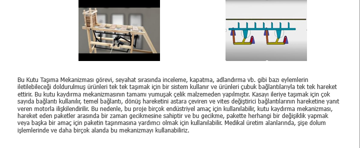

### Step 2: Studying the Real Mechanism Operation

The working principle of the mechanism was studied by comparing a real-life mechanism with the MATLAB simulation model.

The mechanism uses link motion to push and move boxes forward in a controlled sequence.

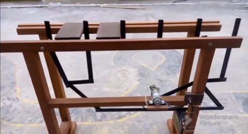

### Step 3: Designing the Mechanism Layout

The mechanism layout was created by numbering the links and defining the moving parts.

The mechanism includes lower moving linkages, an upper moving part, and multiple contact or pushing elements used to move the boxes.

Main design parameters included:

* Driving link angular velocity: **0.3 deg/s**
* Driving link angular acceleration: **0.5 deg/s²**
* Simulation time: **360 seconds**
* Link 2 and 7 length: **0.6 m**
* Link 3 and 8 length: **1.15 m**
* Link 4 length: **0.7 m**
* Link 5 and 9 length: **0.2 m**
* Link 6 length: **0.5 m**
* Link 10 length: **0.8 m**
* Link 11 length: **6 m**
* Links 12, 13, 14, 15, and 16 length: **0.25 m**

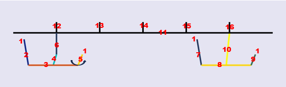

### Step 4: Defining Mechanism Elements

The mechanism was built using revolute joints, welded joints, link bodies, joint sensors, body sensors, joint actuators, ground elements, machine environment, mux/demux blocks, sine wave input, ramp input, and scope blocks.

The model included revolute joints such as 12, 23, 34, 35, 46, 51, 611, 71, 78, 89, 810, and 91.

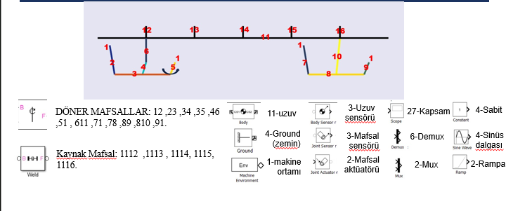

### Step 5: Building the MATLAB/Simulink Model

The mechanism was modeled in MATLAB/Simulink using a structured block diagram.

The model was divided into:

* Lower moving mechanism 1
* Lower moving mechanism 2
* Upper moving mechanism

Each part was connected to represent the complete box transfer mechanism.

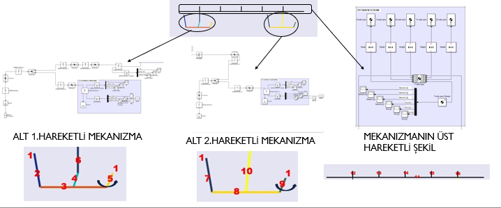

### Step 6: Calculating the Degree of Freedom

The mechanism degree of freedom was calculated using the planar mobility equation:

**F = 3(n - 1) - 2e1 - e2**

Using:

* **n = 11**
* **e1 = 12**
* **e2 = 0**

The calculated degree of freedom was:

**F = 6**

This indicates that the system is a multi-degree-of-freedom mechanism.

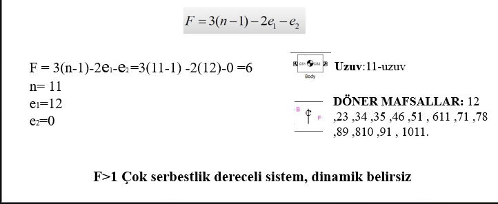

### Step 7: Running the MATLAB Simulation

After building the mechanism model, the simulation was run in MATLAB/Simulink to observe the motion behavior of the box transfer mechanism.

The simulation showed how the linkage system moves and transfers the box along the path.

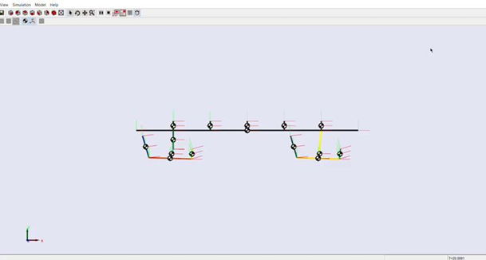

### Step 8: Joint Motion Analysis

The motion behavior of selected revolute joints was analyzed using angle, angular velocity, and angular acceleration graphs.

The analysis included joint 6 and joint 5 to evaluate the rotational behavior of the mechanism during the motion cycle.

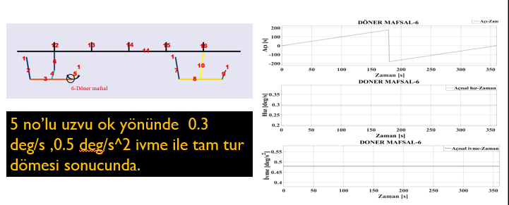

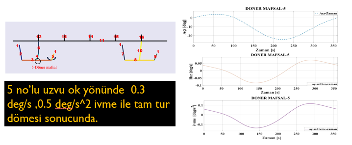

### Step 9: Lower Moving Part Analysis

The lower moving mechanism was analyzed using velocity and acceleration results. These results helped evaluate the motion response of the lower linkage system.

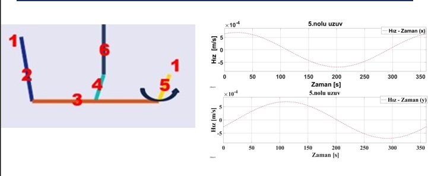

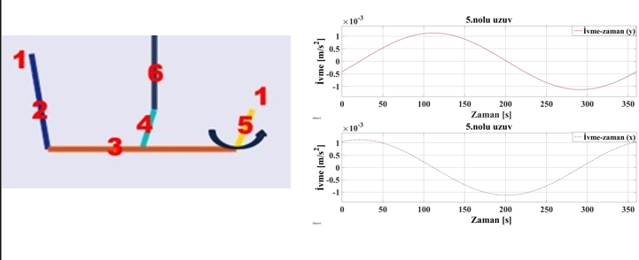

### Step 10: Upper Moving Part Analysis

The upper moving part was analyzed using velocity and acceleration graphs. This helped evaluate the movement of the upper transfer element responsible for supporting or guiding the box movement.

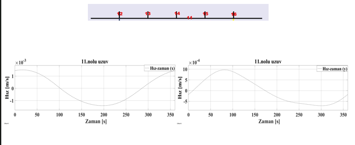

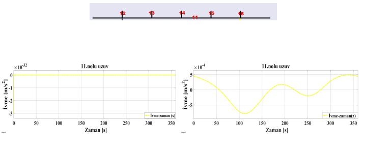

## 6. Engineering Analysis Performed

The project included the following engineering and simulation tasks:

* Mechanism concept analysis
* Linkage design
* Link dimension definition
* Joint configuration
* Revolute joint modeling
* Welded joint modeling
* MATLAB/Simulink model building
* Simscape Multibody simulation
* Degree of freedom calculation
* Sinusoidal input motion definition
* Kinematic motion analysis
* Joint angle analysis
* Angular velocity analysis
* Angular acceleration analysis
* Link velocity analysis
* Link acceleration analysis
* Production-line motion evaluation

## 7. Key System Settings and Results

* **Mechanism type:** Box transfer linkage mechanism
* **Software used:** MATLAB/Simulink
* **Simulation environment:** Simscape Multibody
* **Driving input:** Sinusoidal motion
* **Driving link angular velocity:** 0.3 deg/s
* **Driving link angular acceleration:** 0.5 deg/s²
* **Simulation time:** 360 seconds
* **Number of links used in DOF calculation:** 11
* **Number of one-degree-of-freedom joints:** 12
* **Calculated degree of freedom:** 6
* **Main analysis outputs:** Angle, angular velocity, angular acceleration, linear velocity, and linear acceleration graphs

## 8. Project Images and Explanation

### Project Overview

This image explains the general purpose of the box transfer mechanism and its industrial applications.

### Real Mechanism Operation

This image shows how a real box transfer mechanism operates in practice.

### Mechanism Design

This image shows the designed mechanism layout, link numbers, and main link dimensions.

### Mechanism Elements

This image shows the mechanism components and MATLAB/Simulink blocks used to build the model.

### MATLAB/Simulink Block Diagram

This image shows the structured MATLAB/Simulink model of the mechanism.

### Degree of Freedom Calculation

This image shows the degree of freedom calculation and the mobility equation used for the mechanism.

### MATLAB Simulation

This image shows the mechanism simulation inside MATLAB/Simulink.

### Joint Analysis

These images show angle, angular velocity, and angular acceleration results for selected revolute joints.

### Lower Moving Part Analysis

These images show velocity and acceleration analysis for the lower moving mechanism.

### Upper Moving Part Analysis

These images show velocity and acceleration analysis for the upper moving mechanism.

## 9. Skills Demonstrated

This project demonstrates the following engineering skills:

* Mechanism design
* Kinematic analysis
* MATLAB/Simulink modeling
* Simscape Multibody simulation
* Linkage mechanism analysis
* Degree of freedom calculation
* Revolute joint modeling
* Welded joint modeling
* Motion input definition
* Joint sensor and body sensor usage
* Actuator modeling
* Mux and demux signal handling
* Position, velocity, and acceleration interpretation
* Production-line automation concept
* Mechanical system simulation
* Technical documentation

## 10. Project Files

The full project report is available in the `report/` folder:

[View Full Project Report](report/Box-Transfer-Mechanism-Simulation.pdf)

## 11. Conclusion

This project helped me understand the design and simulation process of a multi-link box transfer mechanism used in production-line applications.

Through this project, I practiced mechanism design, MATLAB/Simulink modeling, Simscape Multibody simulation, degree of freedom calculation, and motion analysis using angle, velocity, and acceleration graphs.

The final simulation demonstrates how a linkage mechanism can be used to transfer boxes or products sequentially along a production line while creating controlled motion intervals for industrial operations.

## Author

Mohamed Osman
Mechanical Engineering
